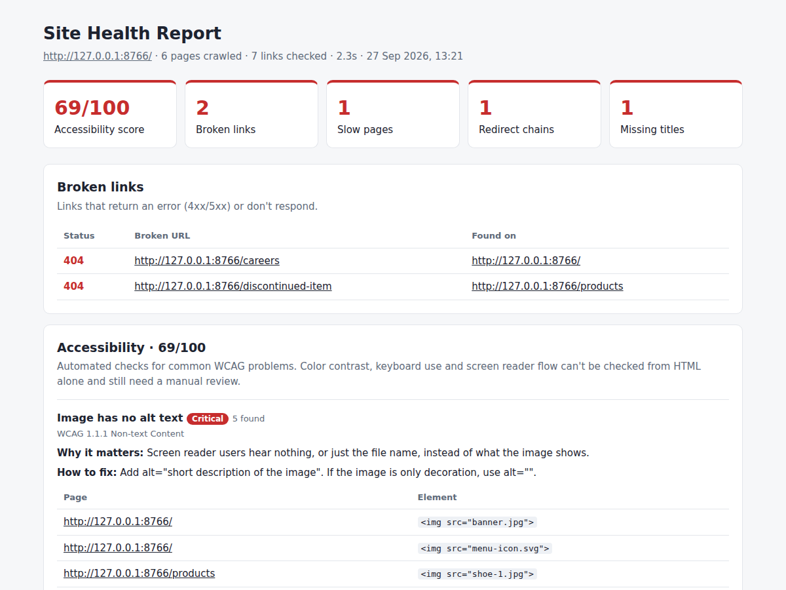

# 🩺 Site Health Checker

[](https://github.com/Reenakotadiya/site-health-checker/actions/workflows/tests.yml)
[](https://www.python.org/)
[](LICENSE)

**Audit any website for accessibility and broken links in one command, with a report anyone can understand.**

Site Health Checker crawls your whole site and finds the problems that shut out users with disabilities, frustrate visitors and hurt SEO:

- ♿ **Accessibility (WCAG) problems**, explained in plain English with **how to fix each one**, plus an overall **score out of 100**
- ❌ **Broken links**: 404s, 500s and links that don't respond, plus the page each one appears on
- 🐢 **Slow pages**
- 🔀 **Redirect chains**: links that bounce through 2+ redirects
- 🏷️ **Missing page titles**

You get a clean **HTML report** you can hand to a developer, a manager or a client, plus **JSON** for CI pipelines.



---

## 🚀 Quick Start

```bash
pip install git+https://github.com/Reenakotadiya/site-health-checker.git

site-health-checker https://example.com
```

Then open `site-health-report.html` in your browser.

```
Site Health Report for https://example.com/
Crawled 6 pages and checked 7 links in 2.3s

  ✗ Accessibility score: 69/100 (17 issues on 3 pages)
         5  Image has no alt text [critical]
         3  Form field has no label [critical]
         1  Button has no text [critical]
         3  Zooming is disabled [serious]
         2  Link has no text [serious]
  ✗ Broken links: 2
           404  https://example.com/careers
  ✓ Slow pages: 0
  ✓ Redirect chains: 0
  ✓ Pages missing a title: 0
```

---

## ♿ Accessibility Checks

Why it matters: accessibility is a legal requirement in more and more places (such as the **European Accessibility Act** and the **ADA** in the US), and around 1 in 6 people worldwide lives with a disability.

| Check | Severity | WCAG |
|---|---|---|
| Image has no alt text | Critical | 1.1.1 |
| Form field has no label | Critical | 1.3.1 / 4.1.2 |
| Button has no text | Critical | 4.1.2 |
| Link has no text | Serious | 2.4.4 |
| Page language is not set | Serious | 3.1.1 |
| Zooming is disabled on mobile | Serious | 1.4.4 |
| Page title is missing | (reported separately) | 2.4.2 |
| Page has no main heading (h1) | Moderate | best practice |
| Heading levels are skipped | Moderate | best practice |

Every issue in the report comes with **why it matters** and **how to fix it**, written for people who aren't accessibility experts.

**The score:** each page starts at 100 and loses 10 points per critical issue, 5 per serious and 2 per moderate. The site score is the average across all pages.

> **Honest note:** automated checks catch many of the most common problems, but **no tool can prove a site is fully accessible.** Color contrast, keyboard navigation and how the page sounds in a screen reader still need a manual review. Use this tool to find and fix the obvious issues fast, then test by hand.

The checker avoids false alarms: `alt=""` on decorative images, hidden inputs, submit buttons, fields wrapped in a `<label>` and `aria-label`/`aria-labelledby` are all treated as valid.

---

## ⚙️ Options

| Option | Default | What it does |
|---|---|---|
| `--max-pages N` | 100 | Maximum number of pages to crawl |
| `--workers N` | 10 | Number of parallel requests |
| `--timeout SEC` | 10 | Seconds to wait for each request |
| `--slow SEC` | 2 | Load time above which a page counts as slow |
| `-o, --output PATH` | `site-health-report.html` | Where to save the HTML report |
| `--json PATH` | off | Also save all results as JSON |
| `--min-score N` | off | Exit with code 1 if the accessibility score is below N |
| `--no-fail` | off | Always exit with code 0 |
| `--version` | | Show the version |

```bash
site-health-checker mysite.com --max-pages 500              # bigger crawl ("https://" is added for you)
site-health-checker https://mysite.com --slow 1 -o audit.html  # stricter speed check, custom report name
site-health-checker https://mysite.com --json results.json  # machine-readable output
```

---

## 🔄 Use It in CI/CD

The tool **exits with code 1 when broken links are found, or when the accessibility score drops below `--min-score`**, so it can block a release automatically. Example GitHub Actions step:

```yaml
- name: Check website health
  run: |
    pip install git+https://github.com/Reenakotadiya/site-health-checker.git
    site-health-checker https://staging.mysite.com --min-score 90 --json results.json
```

---

## 🧠 How It Works

1. Starts at your URL and follows its redirects, so `http://` → `https://` and `www` are handled
2. Crawls every page on the **same domain** (breadth-first, in parallel), up to `--max-pages`
3. **Respects `robots.txt`**, so pages the site asks bots not to visit are skipped
4. Runs the accessibility checks on every HTML page
5. Checks every link found, **internal and external**, once each (`HEAD` first, falling back to `GET` for servers that reject `HEAD`)
6. Writes the HTML report, the JSON output and a console summary

Pages rendered only by JavaScript (single-page apps) are checked as the server sends them.

---

## 🧪 Development

```bash
git clone https://github.com/Reenakotadiya/site-health-checker.git
cd site-health-checker
pip install -e ".[dev]"
pytest
```

Almost 50 tests cover every accessibility rule (including the cases that must **not** be flagged), and a small local website with known problems tests the crawler end to end, with no internet needed.

---

## 🤝 Contributing

Issues and pull requests are welcome! On the roadmap:
- Color contrast checks using a headless browser
- Duplicate IDs, and missing skip-to-content links
- Sitemap.xml support
- A PDF version of the report

---

## 📄 License

[MIT](LICENSE) © Reena Kotadiya

---

## 👩‍💻 Author

**Reena Kotadiya**, QA Automation Engineer

[](https://www.linkedin.com/in/reena-kotadiya-1a7073170)

💼 Need a website accessibility audit or test automation for your project? Let's connect on LinkedIn.
